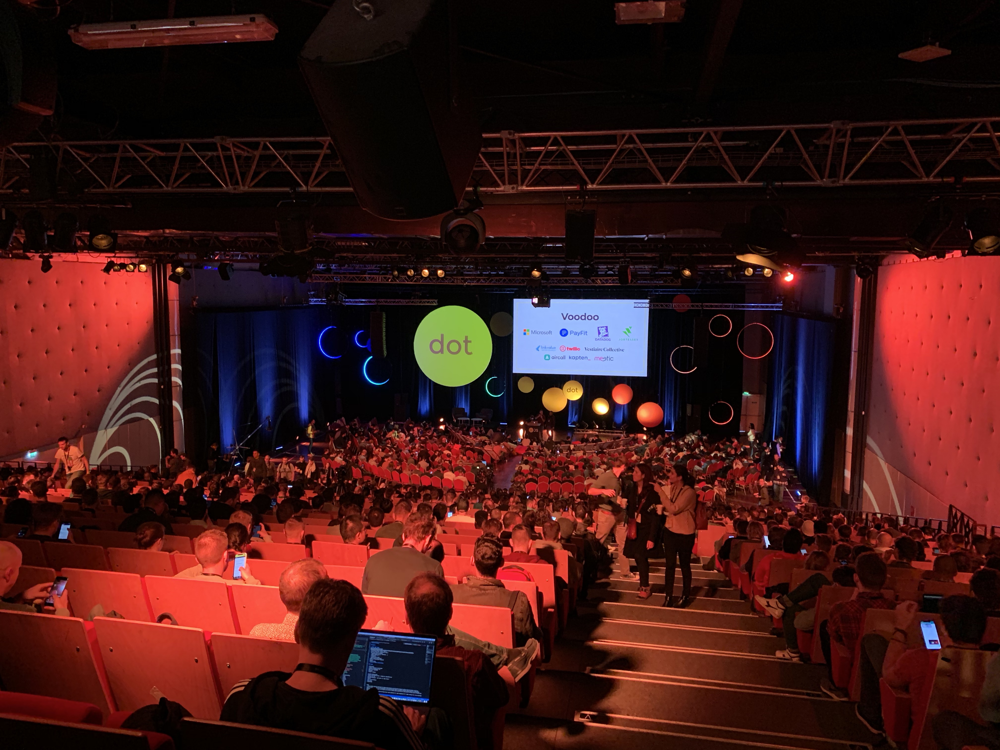
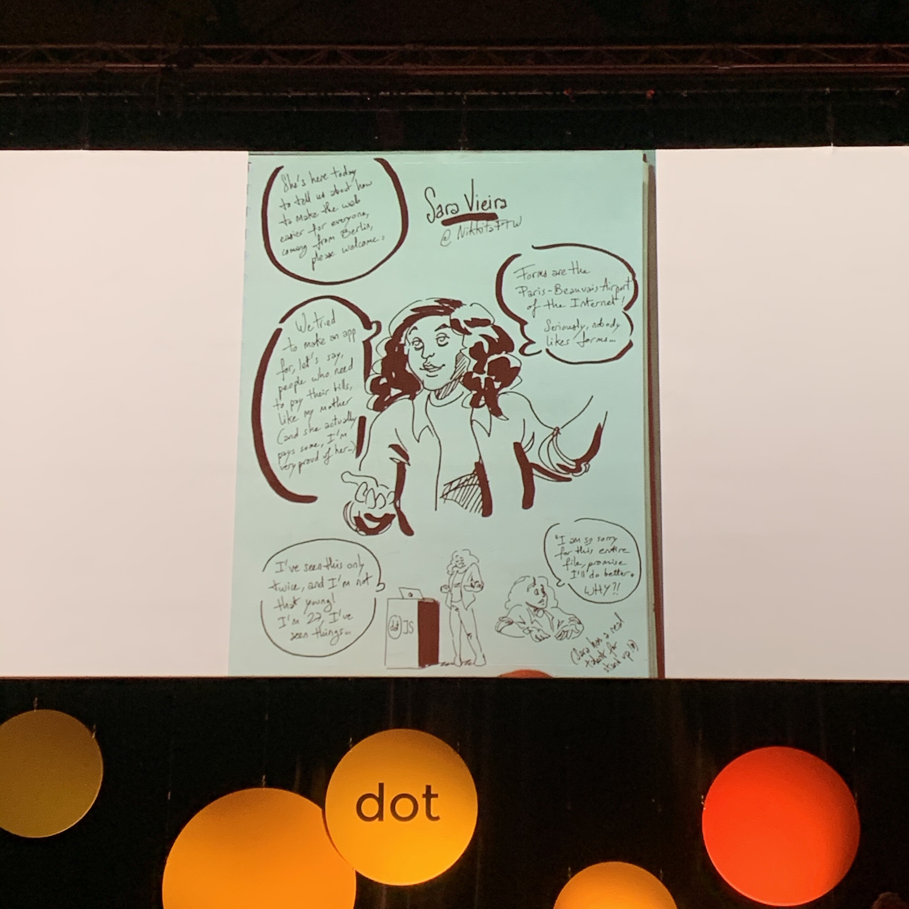

I went to dotJS 2019 for both days(5th to 6th). I thought it might be good to write down what I felt during the days. For your information, this is not going to be a summary of talks.

When I was in Korea, I barely went to conferences. I guess I did once or twice. The biggest reason was because I don't like to go to crowded place. I cannot stand the active social encounters and the awkwardness when I'm not around anyone while others are.

There is another reason. In tech scene in Korea, everything seems slow. When there is something new, some people get the news from Twitter, YouTube, blogs, etc, but the most of people don't care much until the materials are translated into Korean and spread broadly. When I went to conferences a few times in the early days of my career, they were mostly translated version of what I already learned online like months, or even a year ago. I don't know how they are these days. I'm not blaming but just telling what I experienced and felt back then.

Now I live in Paris. dotJS 2019 was held in Paris. I don't need any flight or accomodation and even my company(Algolia) pays for my ticket. And to me, the speakers are like super star on Twitter. I got interested. I had to be there.

The talks were interesting and inspiring with new ideas and experiments. Yes, that's what I came for!

During the breaks, they displayed drawings of the talks. It was done by [Florine Pigny](https://twitter.com/FlorinePigny). During the talks, she drew those simultaneously. Amazing.

https://twitter.com/eunjae_lee/status/1202597131489566726
