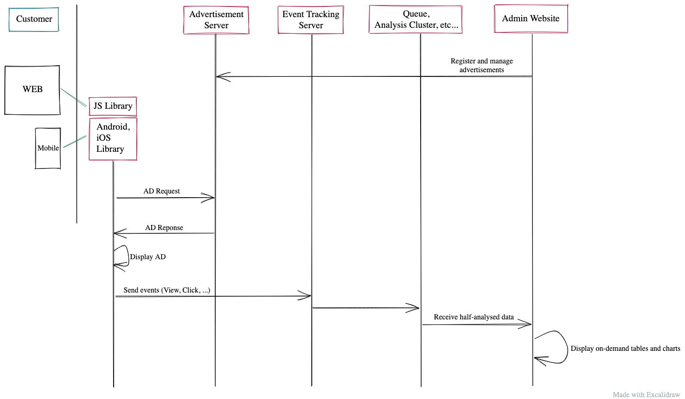

import TweetEmbed from 'react-tweet-embed';

From 2015 to 2018, I worked for a company where we built a mobile advertisement service in Korea.

The following is a drawing of the over-simplified version of the things we had.



The admin website was built on an old stack, of course. It was a monolithic Ruby on Rails project(I don't remember the version) with PostgreSQL and Angular**JS**. Totally 5 people including me had touched that project over about 4 years. It was a perfect exhibition displaying every possible way to pass data from the server-side to the client-side. It rendered the template on the server-side with the result of ActiveRecord operations. Sometimes AngularJS parts called REST APIs to get data. Some other parts outside AngularJS called REST APIs with XMLHttpRequest. Some metadata were serialized to `window.globalData` when the page was rendered by rails and the frontend read `window.globalData`. Okay, let me stop here, even though I have more.

There were some changes in the organization. I was told to build the admin website from scratch to fit the exact needs of this new project. I was alone to build the website and other colleagues were in charge of other parts of the system. I guess it was around February in 2018.

It was a small startup and I was left behind the frontend trends. I was surviving in the company, and all of sudden, the whole world had changed the way they implement frontend. I had to catch up. Luckily before the kick-off, I had some free time of one or two months to learn new stuff. Literally, I read tons of articles and documentation for the period. Everything was new. I felt like I became a total beginner. It was overwhelming but also I was glad to see that the JS world got much better than before. It was joyful learning.

Okay, so it's time to kick off. What should I use to build this admin website? It is time to summarize what I have learned so far. It shouldn't be a combination of the coolest things. I gave it a lot of thought and try to find a perfect fit for every teeny-tiny piece.

https://gist.github.com/eunjae-lee/ed596af0c12d4c91b5fbed52744c0043

I wrote that gist back then to share it with the team. Now I see some things are wrong, or some things were already outdated at the time of writing it. Anyway based on that, I've made choices. Let me talk about the choices now.

## Backend and Frontend

I created two separate projects with Ruby on Rails and Vue.js. Since it was too easy to make things messy in the monolithic project without any constraints between backend and frontend, I took a different path this time. I could've investigated more on how to structure a monolithic rails project with a modern frontend library, but I just didn't want to. It turned out great for me. I had two VSCode windows. One was running `rails server`, rspec and rubocop. The other one was running `vue-cli-service serve`, `jest --watch` and eslint and prettier on save. Since the tools were different, it was natural.

I alone was dealing with the two applications at the same time. I was jumping between two VSCode windows every 5 minutes. It's a kind of privilege of a full-stack developer. I didn't have to wait for someone else to give me whatever I want. I could keep altering things until both sides make sense together. However, that frequent change of context was a bummer. It was not about frontend and backend, but it was about ruby and JavaScript. The languages were different, and the toolings were different. If I should do this alone again, then I'd definitely use JavaScript(or TypeScript) only. Not because ruby isn't good, but because using one language improves my productivity in that frequent change of context(I still love ruby).

On top of Ruby on Rails, I used REST API framework named `grape`. It provides such an elegant way.

```ruby
desc 'Return a user.'
params do
  requires :id, type: Integer, desc: 'User ID.'
end
get do
  User.find(params[:id])
end
```

The code above returns a user. If the parameter isn't correct, it gives a proper error message based on the schema. With `grape` you can do

```ruby
params do
  optional :beer
  optional :wine
  exactly_one_of :beer, :wine
end
```

or

```ruby
params do
  optional :beer
  optional :wine
  optional :juice
  at_least_one_of :beer, :wine, :juice
end
```

It was my best experience of developing REST APIs ever.

## React vs Vue.js

Let's move onto the frontend. I chose VueJS. I hadn't had any experience with React or Vue.js(and I didn't want to use Angular). After reading lots of articles and tweets, I had the impression that React world is less opinionated by the core team so there are many different libraries to do the same task. On the other hand, Vue.js seemed very opinionated. It comes with Vue Router, Vuex, etc. I was given a very short time. I knew I didn't have enough time to learn all the differences between state management libraries, routing libraries, and whatnot. And the learning curve for Vue.js seemed lower. It was an obvious decision for me. I was right about it. I still struggled many times during the project, but it was manageable.

## Server-Side Rendering?

I didn't need it. It was an admin website. It's not supposed to be discovered by search engines. I simply went with a single-page application with Vue.js.

## Vue.js vs Nuxt

Sadly I didn't know about Nuxt until the middle of the project. I did hear about it before the beginning but hadn't tried it. If I had some time to try it out, then I must've started it with Nuxt. When the project was at 50%, I tried Nuxt with my side project. And that was the moment I regretted not using it for this project.

## JavaScript vs TypeScript

I as an old developer who has been using typed language a lot, choosing to use TypeScript was not easy at all. I didn't use TypeScript well, though(Too many `any` types and stuff, you know).

## CSS Framework

It's an admin website. No designer was assigned for this. I had to use some pre-built css framework with all sorts of functionalities built-in. I wanted to use Vuetify but it didn't have a file uploader component. It was very important for the project. I couldn't find any good file uploader library based on material design. If it's not for material design, then the website will look ugly and I didn't have time to adjust the design. Buefy based on Bulma looked okay. It had a pretty good file uploader out of the box. It was a little buggy here and there, but overall okay.

## If I do it again now,

Things will be very different from then. It's because as always there are new cool things every day and there are things that I learned since then.

### Vue.js vs React

Ever since I started that project, I kept an eye on React. I never created a react app then but kept reading tweets and articles. My first encounter with React was when I wanted to badly try out Gatsby. I wanted to build my blog and went through [the tutorials](https://www.gatsbyjs.org/tutorial/) from Gatsby. Since I was already a little familiar with the JSX and stuff around React, it was smooth to follow the tutorial. And now, I feel more attached to React. I'm not sure if it's Gatsby or React itself. Probably it's the aspect where it's more JavaScript-y in React. Since it's an admin website, I will Next.js.

### CSS

At the time of writing this, I'm still on my journey to find out what is my favorite way to write css. So far I have tried tailwind, styled component, emotion, css modules, and theme-ui. Not seriously though. But again, this is an admin website. I'd probably use material-ui or whatever is good. I haven't explored this area, so I have no idea.

### Database

I will probably use services like [Hasura](https://hasura.io/), [FaunaDB](https://fauna.com/), etc. I haven't used them, but it was too much of a pain for me as a single developer to maintain a PostgreSQL database on AWS by myself while I actually develop the whole stack of the website. I'll pay more and get more service to make life easier.

### CMS?

I might not use Next to build my website, but use CMS solutions like [Prisma](https://www.prisma.io/) or [KeystoneJS](https://www.keystonejs.com/). I haven't used them, so I cannot tell for sure, but with proper schema given, they take care of so many parts of the repetitive code that I had previously. They even come with a dashboard to CRUD records. If I take a radical path, then I could use [Sanity](sanity.io/) and bind all the webhooks to my serverless functions to do extra work.

Recently I have tried out some CMS services. Of course, there are services where they cannot use CMS services but they have to build everything from scratch because of their x, y, and z. However, on the other hand, there are so many websites that can be easily built with CMS services. These days when I look at websites, I ask myself if it's efficient to build them with a CMS service. In many cases, the answer is yes. Either hosted or on-premise, the CMS services/solutions will bring enormous value to the scene.

---

In just 2 years, many things have changed and my thought has changed. In the next 2 years, things will change again. Perhaps in a more radical way that I cannot even imagine?

Let's see how it goes!

<TweetEmbed id="1253803164861706244" />
